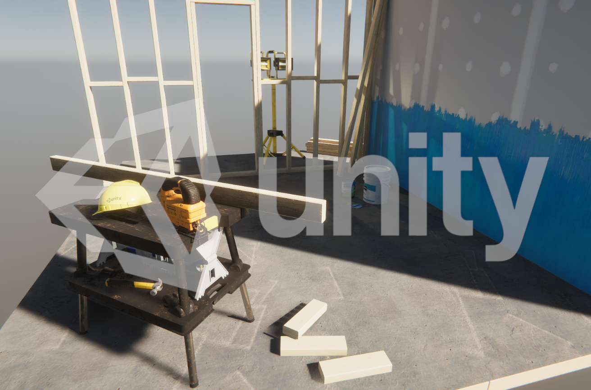
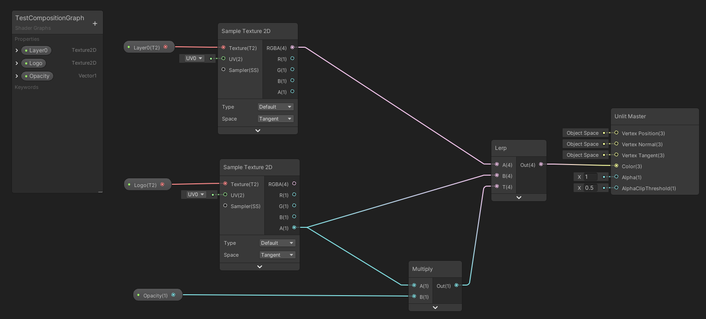

# Compositor (Preview)

The Compositor is a tool that allows real-time compositing operations between animated sequences that are generated in real-time with Unity (currently with HDRP) and external media sources, such as video and images. Depending on the requirements of an application, the Compositor allows setting up a combination of different types of composition operations:
- **Camera Stacking:** Allows multiple HDRP cameras to render on top of the same render target.
- **Graph-based Composition:** Allows multiple composition layers to be combined using arbitrary mathematical operations in order to generate the final frame.
- **3D Composition:** Allows compositing layers to be used as surfaces in a unity 3D scene, permitting for example reflections and refractions between different layers and scene elements.

The following table provides a high level overview of the advantages and disadvantages of each compositing technique:

| Technique  | Performance | Memory Overhead | Flexibility | Feature Coverage [*]|
| ------------- | ------------- |------------- | ------------- | ------------- |
| Camera Stacking  | High  | Low | Low | High |
| Graph-Based Composition | Low(er)  | High | High | Low |
| 3D composition  | Low(er)  | High | Low | High |

[*] *"Feature coverage"* indicates whether rendering features such as screen-space reflections, transparencies or refractions can work between layers.

Furthermore, the compositor exposes functionality such as *"localized post-processing"*, where a post-processing volume affects only certain objects in the scene. 

For a high level overview of the compositor's functionality please refer to the [User Guide](Compositor-User-Guide) section. For a description on specific options in the user interface, please refer to the [User Options](Compositor-User-Options) section.

A simple watermark rendered on top of a 3D scene using the compositor tool:

The composition graph used to create the above image:
