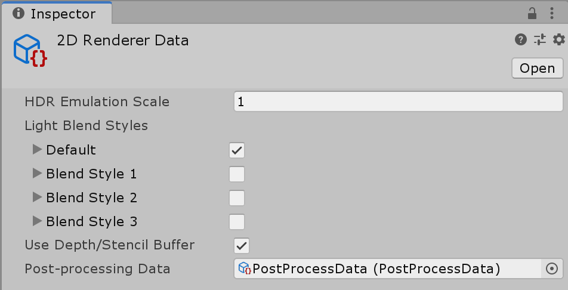

# 2D Renderer Data Asset

The __2D Renderer Data__ Asset contains the settings that affect the way Light is applied to lit Sprites. You can set the way Lights emulate HDR lighting with the [HDR Emulation Scale](HDREmulationScale), or customize your own [Light Blend Styles](LightBlendStyles). 

## Use Depth/Stencil Buffer

This option is enabled by default. Clear this option to disable the Depth/[Stencil](https://docs.unity3d.com/Manual/SL-Stencil.html) Buffer. Doing so might improve your project’s performance, especially on mobile platforms. You should clear this option if you are not using any features that require the Depth/Stencil Buffer (such as [Sprite Mask](https://docs.unity3d.com/Manual/class-SpriteMask.html)). 

## Post-processing Data

Unity automatically assigns a default Asset to this property that contains the resources (such as Textures and Shaders) that the post-processing effects require. If you want to use your own post-processing Shaders or lookup Textures, replace the default Asset.

## Default Material Type

When created, a Sprite will be assigned the selected default Material type. 

__Lit__ -  Uses the Sprite-Lit-Default material. This Material can be lit by 2D lights

__Unlit__ - Uses the Sprite-Unlit-Default material. This Material is unaffected by lighting.

__Custom__ - Uses the Material specified in __Default Custom Material__.    
