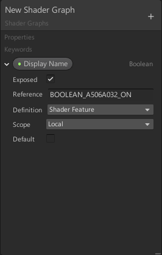
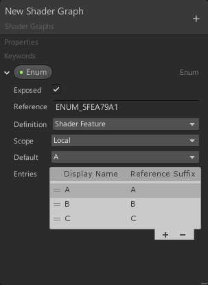
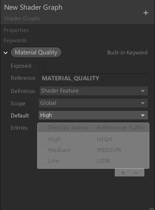

# Keywords

## Description
You can use Keywords to create different variants for your Shader Graph. Depending on the settings for a Keyword and settings in the Editor, the build pipeline might strip these variants. 

Keywords are useful for many reasons, such as:
- Creating shaders with features that you can turn on or off for each Material instance.
- Creating shaders with features that behave differently on certain platforms.
- Creating shaders that scale in complexity based on various conditions.

There are three types of Keyword: Boolean, Enum, and Built-in. Based on its type, Unity defines a Keyword in the graph, shader, and optionally, the Material Inspector. See [Boolean Keyword](#BooleanKeywords), [Enum Keyword](#EnumKeywords), and [Built-in Keyword](#BuiltinKeywords) for more information about Keyword types. For more information about how these Keywords affect the final shader, see documentation on [Making multiple shader program variants](https://docs.unity3d.com/Manual/SL-MultipleProgramVariants.html).

In Shader Graph, you first define a Keyword on the [Blackboard](Blackboard), and then use a [Keyword Node](Keyword-Node) to create a branch in the graph.

## Common parameters
Although some fields are specific to certain types of Keywords, all Keywords have the following parameters.

| **Name**           | **Type** | **Description**                                              |
| ------------------ | -------- | ------------------------------------------------------------ |
| **Display Name**   | String   | The display name of the Keyword. Unity shows this name in the title bar of nodes that reference the corresponding Keyword, and also in the Material Inspector if you expose that Keyword. |
| **Exposed**        | Boolean  | If you set this to **true**, Unity displays the corresponding Keyword in the Material Inspector. If you set it to **false**, the Keyword does not appear in the Material Inspector. |
| **Reference Name** | String   | The internal name for the Keyword in the shader.  If you overwrite the Reference Name parameter, take note of the following: &#8226; Keyword Reference Names are always in full capitals, so Unity converts all lowercase letters to uppercase. &#8226; If the Reference Name contains any characters that HLSL does not support, Unity replaces those characters with underscores. &#8226; Right-click on a Reference Name, and select **Reset Reference** to revert to the default Reference Name. |
| **Definition**     | Enum     | Sets how the Keyword is defined in the shader.  There are three available options. &#8226; **Shader Feature**: Unity strips unused shader variants at build time. &#8226; **Multi Compile**: Unity never strips any shader variants. &#8226; **Predefined**: Indicates that the active Render Pipeline has already defined this Keyword, so Shader Graph does not define it in the code it generates. |
| **Scope**          | Enum     | Sets the scope at which to define the Keyword.  &#8226; **Global Keywords**: Defines Keyword for the entire project, and it counts towards the global keyword limit. &#8226; **Local Keywords**: Defines Keyword for only one shader, which has its own local keyword limit.  When you use Predefined Keywords, Unity disables this field. |

## Boolean Keywords
Boolean Keywords are either on or off. This results in two shader variants. Shader Graph uses the value in the **Reference** name field for the on state, and automatically defines the off state as an underscore ( `_` ).

To expose a Boolean Keyword in the Material Inspector, its **Reference** name must include the `_ON` suffix. For example, `BOOLEAN_A506A032_ON`.

### Type-specific parameters
In addition to the common parameters listed above, Boolean Keywords have the following additional parameter.

| **Name**    | **Type** | **Description**                                              |
| ----------- | -------- | ------------------------------------------------------------ |
| **Default** | Boolean  | Enable the checkbox to set the Keyword's default state to on, and disable the checkbox to set its default state to off.  This checkbox determines the value to use for the Keyword when Shader Graph generates previews. It also defines the Keyword's default value when you use this shader to create a new Material. |

## Enum Keywords
Enum Keywords can have two or more states, which you define in the **Entries** list. If you expose an Enum Keyword, the **Display Names** in its **Entries** list appear in a dropdown menu in the Material Inspector.

When you define an Enum Keyword, Shader Graph appends a sanitized version of the **Entry Name** to the main **Reference** name to define each state. The sanitized version of the **Entry Name** can be seen to the right, under **Reference Suffix**. It uses the `{Reference}_{ReferenceSuffix}` pattern to define most entries, but be aware that it uses an `else` statement to select the last entry, which it regards as the off state.

Special characters such as `( )` or `! @` are not valid in the **Entry Name** of an Enum Keyword. Invalid characters will be converted to an underscore ( `_` ). 

### Type-specific parameters
In addition to the common parameters listed above, Enum Keywords have the following additional parameters.

| **Name**    | **Type**         | **Description**                                              |
| ----------- | ---------------- | ------------------------------------------------------------ |
| **Default** | Enum             | Select an entry from the drop-down menu to determine which value to use for the Keyword when Shader Graph generates previews. It also defines the Keyword's default value when you use this shader to create a new Material. When you edit the Entries list, Shader Graph automatically updates the options in this dropdown menu. |
| **Entries** | Reorderable List | This list defines all the states for the Keyword. Each state has a separate **Display Name** and **Reference Suffix**.  &#8226; **Display Name**: Appears in drop-down menus for the Keyword on the Blackboard and the Material Inspector. Shader Graph also uses this name for port labels on nodes that reference the Keyword. &#8226; **Reference Suffix**: Shader Graph uses this suffix to generate a Keyword state in the shader. |

## Built-in Keywords
Built-in Keywords are always either Boolean or Enum Keywords, but they behave slightly differently. The Unity Editor or active Render Pipeline sets their values, and you cannot edit them. 

All Built-in Keyword fields on the Blackboard are grayed out except for the **Default** field, which you can enable or disable to show the differences in Shader Graph previews. You also cannot expose Built-in Keywords in the Material Inspector.

